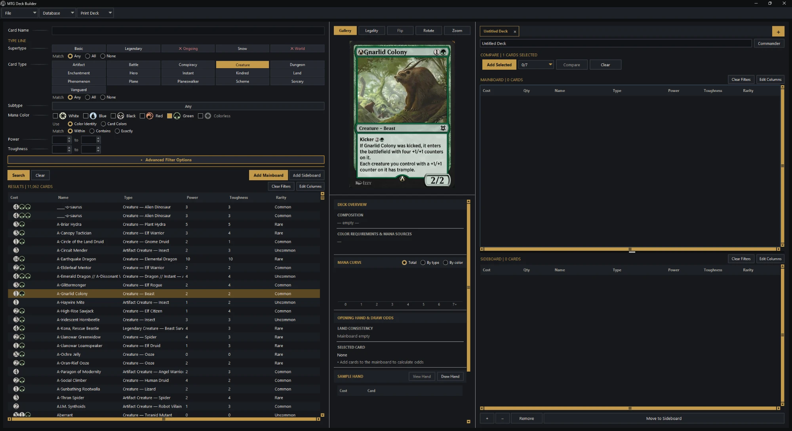
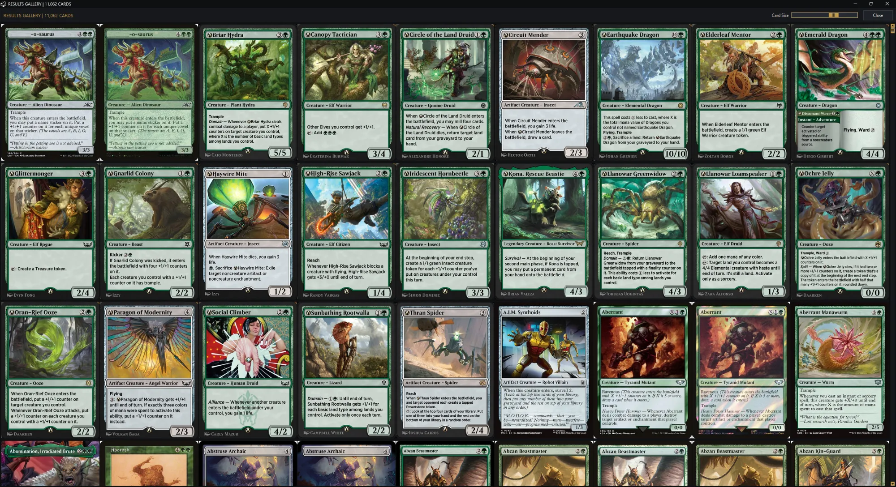
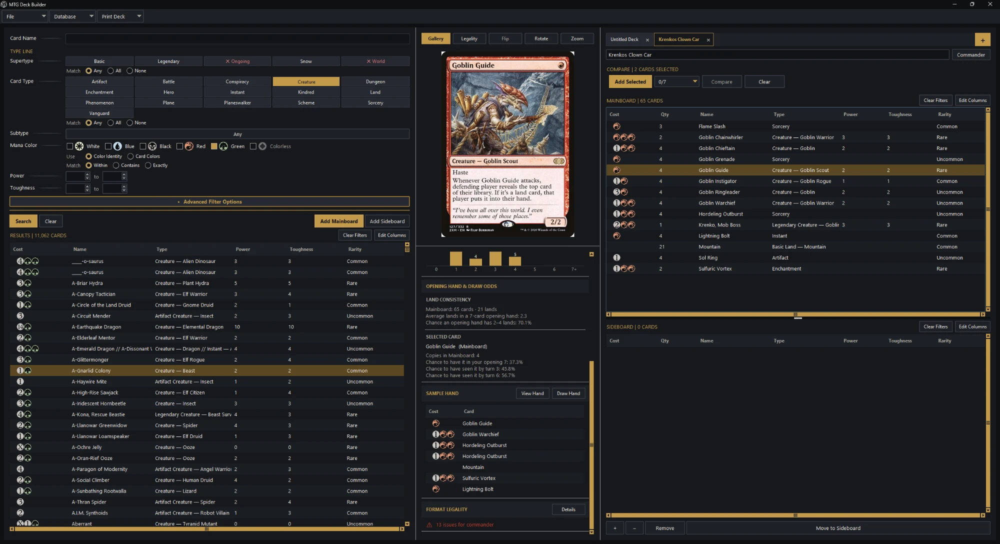
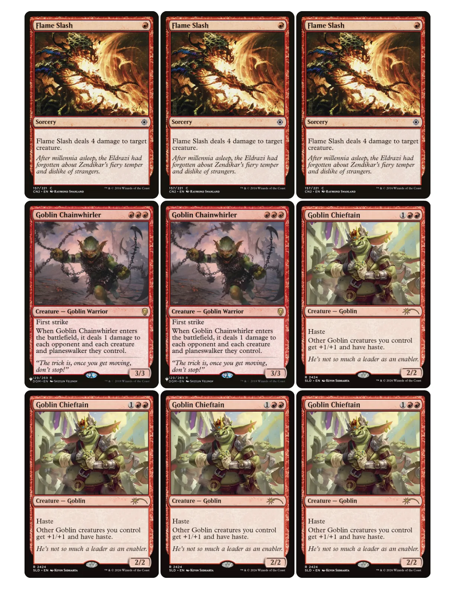

# MTG Deck Builder

A fast, portable desktop deck builder for **Magic: The Gathering**. Search the
full card pool with rich live filters, build and analyze decks, compare printings
side by side at full art, and print proxy sheets — all offline after the first
data sync.

Windows desktop app (Python + Tkinter). No account, no telemetry; your decks and
settings stay on your machine.

## Download & run (Windows)

1. Download the latest `MTG_Deck_Builder-*-windows.zip` from the
   [**Releases page**](https://github.com/RudeLeft/MTG_Deck_Builder/releases/latest).
2. Unzip it and keep the `MTGDeckBuilder` folder together.
3. Run `MTGDeckBuilder.exe`.

No Python required. The app is fully portable — it keeps its card database and
your saved decks in its own folder and writes nothing to AppData or the registry,
so you can copy the folder between PCs or run it from a USB stick.

On first launch it downloads current card data from [Scryfall](https://scryfall.com)
(a few hundred MB); after that it runs offline and refreshes on its own schedule.

## Features

- **Search** the full card pool with live, contextual filters — colors, mana
  value, power/toughness, types, subtypes, keywords, formats, rarity, and more —
  each option showing how many cards still match your other filters.
- **Deck building** with mainboard and sideboard, quantities, and basic
  format-legality checks.
- **Comparison view** — line up multiple printings side by side at full art to
  pick your favorite.
- **Proxy printing** to PDF — pulls Scryfall's high-resolution card PNGs so
  printed cards stay crisp, laid out at the correct size with cut guides.
- **Portable & private** — everything lives in one folder; nothing leaves your
  machine except card-data downloads from Scryfall.

## Screenshots

Search and browse the full card pool, with a live gallery preview and a deck
panel showing composition, mana curve, and draw odds:



The full-art results gallery, with an adjustable card size:



Building a deck, with live mana curve, opening-hand draw odds, a sample hand, and
format-legality checks:



Proxy sheets exported to PDF — the app pulls Scryfall's high-resolution card
PNGs so the printed cards stay crisp, laid out at the correct size with cut
guides for trimming:



## Build from source

Requires **Python 3.11+**.

```bash
pip install .
python -m mtgdb
```

To build the standalone Windows executable yourself, run `build_windows.bat`. It
creates an isolated build environment, runs the project's checks, and produces
the portable app in `dist/MTGDeckBuilder/`.

## Card data & legal

Card data and imagery are provided by [Scryfall](https://scryfall.com) and are
subject to Scryfall's and Wizards of the Coast's terms.

This is an unofficial tool. It is **Fan Content** permitted under the
[Wizards of the Coast Fan Content Policy](https://company.wizards.com/en/legal/fancontentpolicy).
It is not approved, endorsed, sponsored by, or affiliated with Wizards of the
Coast. Magic: The Gathering, all card names and images, and related properties
are trademarks of and © Wizards of the Coast LLC.

## License

Released under the [MIT License](LICENSE) — do whatever you like with the code,
just keep the copyright notice. The license covers this project's own source
only, not Magic: The Gathering card data or imagery (see above).
